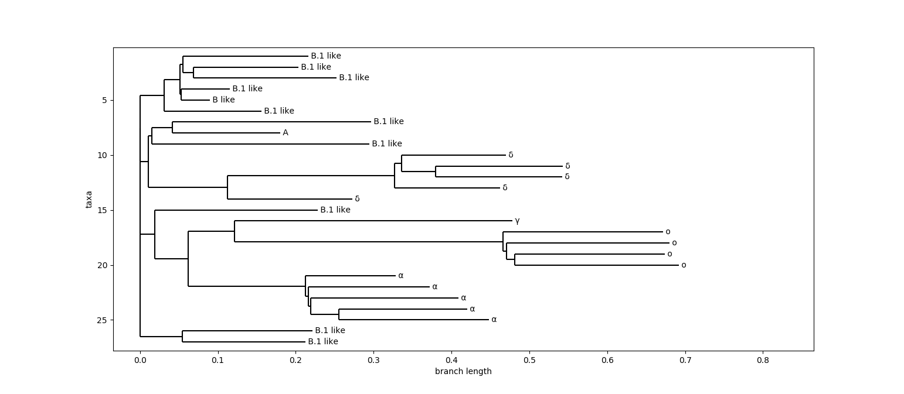

# Phylogenetic tree for COVID-19

## Install and run

First of all install the requirements with `pip install -r requirements.txt`

### Download dataset

De dataset was obtained on NCBI following this [link](https://www.ncbi.nlm.nih.gov/datasets/coronavirus/genomes/). The whole covid period was selected.

### Preprocess the data

To obtain the distance matrix two scripts are used, the first one `dataset_generator.py` is used
to subsample the data. To use it you shold decompress the dataset and then place its path at the
header of the script.

Then `distance_matrix.py` computes the distance matrix based on the output of the previous script
which is written to a file. This distance matrix is output to a file as well.

### Generate vizusations

To produce the final vizualisations simple run all of the `get_XXX.py` scripts.

## Summary

A full report is present in file `report_AloysiogalvaoLopes.pdf` with all references as well.
This project aims at creating a phylogenetic tree based on concepts of algorithmic information.
More precisely, the normalized compression distance (NCD) is used as base to compute a distance
matrix thats later used to compute a phylogenetic tree for the coronavirus.

The final tree is shown below. To obtain this tree, 1274 genomes of SARS-CoV-2 are sampled from
within the whole COVID-19 pandemic crisis until today (03/2022). Then, they're clustered in 27
small clusters using complete-linkage hierarchical clustering. Each cluster is labeled based on
the dominant variant and then, the final tree is generated by the neighbor joining method.
Variants without a WHO name are labeled based on PANGO.

